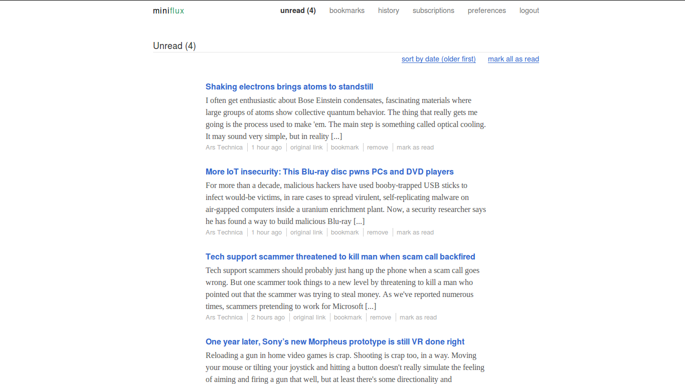
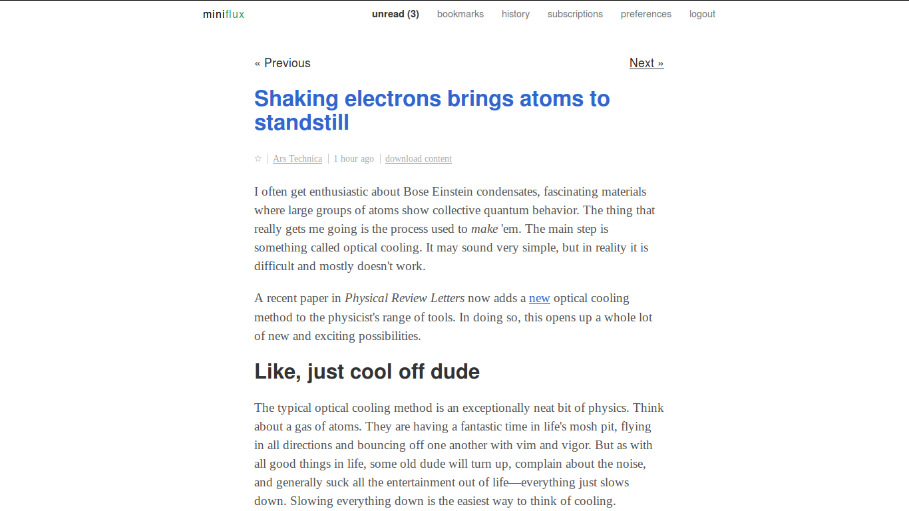

Mir theme for Miniflux
======================

This is my edit of the default theme for [Miniflux](https://github.com/miniflux/miniflux), a minimalist libre RSS feed reader. My goal is to make it even more minimalist, and easier to read. _Mir_ means peace in many Slavic languages.

Screenshots
-----------
Right click/view image for full-res shot.

License
-------
Affero GPL: <http://www.gnu.org/licenses/agpl-3.0.txt>

Authors
-------
Original author: [Frédéric Guillot](http://fredericguillot.com/)

